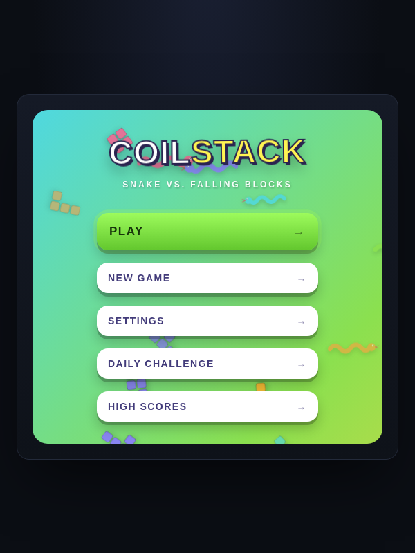

# Coilstack

**Snake vs. falling blocks.** A browser-based arcade game built with HTML5 Canvas, vanilla JavaScript, and CSS — no game engine, no framework, no dependencies.



## Play

Coilstack runs entirely client-side. Just open `coilstack.html` in any modern browser — no build step, no server required.

## Concept

Coilstack combines two classic, independently massive genres:

- **Snake** — you control a continuously moving snake on a 20x20 grid, steered with the arrow keys.
- **Tetris-style falling blocks** — tetromino pieces fall from the top of the grid and stack up.

A short snake must **dodge** falling blocks — getting hit ends the run. Once the snake grows long enough, it can **eat** blocks instead, growing further and scoring points. Filling a complete row clears it for bonus score, Tetris-style. As your score rises, both the snake's speed and the blocks' fall rate increase — the same escalating difficulty curve that made both original games so replayable.

## Features

- Full menu system: Play, New Game, Settings, Daily Challenge, High Scores
- Customisable snake colour (presets or any custom shade)
- Six hand-drawn canvas backgrounds: arcade, beach, space, indoors, underwater, safari
- **Daily Challenge** — a seeded variant so every player gets the same layout on a given date
- Persistent local high-score table (top 20 runs)
- Automatic session save/resume via `localStorage` — close the tab mid-game and pick up where you left off

## Tech stack

| Technology | Purpose |
|---|---|
| HTML5 Canvas | All game rendering (grid, snake, blocks, backgrounds) |
| Vanilla JavaScript (ES6+) | Game loop, collision detection, state management |
| CSS3 | Menus, HUD, screen transitions |
| Web Storage API | High scores, settings, session persistence |

## Controls

| Key | Action |
|---|---|
| Arrow keys / WASD | Steer the snake |
| P | Pause / resume |

## Project structure

```
coilstack.html   # entire game: markup, styles, and logic
docs/            # screenshots used in this README
```

## Development notes

This project was built as a summative assessment for an Occupational Certificate in Software Engineering, with a deliberate focus on implementing game-loop architecture, collision detection, and browser persistence from first principles rather than relying on a game engine.

## License

Released under the MIT License — see [LICENSE](LICENSE).
